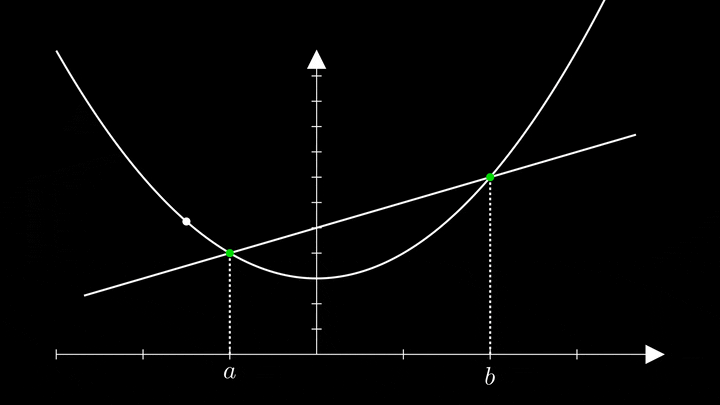

import NormalSection from '@components/base/NormalSection.astro';
import SimpleSection from '@components/base/SimpleSection.astro';
import TwoColumnSection from '@components/base/TwoColumnSection.astro';
import LabeledImage from '@components/base/LabeledImage.astro';
import ArticleList from '@components/base/ArticleList.astro';
import ArticleCard from '@components/base/ArticleCard.astro';
import SocialList from '@components/base/SocialList.astro';
import FeaturedArticles from '@components/base/FeaturedArticles.astro';

import BaseButton from '@components/base/BaseButton.astro';

import { Icon } from '@astrojs/starlight/components';

<SimpleSection>
  ## What is Akagi about?

  (Just for the sake of curiotisy, **Akagi** stands for ???)

  Most classes, articles and videos are very poor in the sense that they make you think you were able to master a topic. When in fact, you have no clue what you are doing. At the end, it all comes down to memorization. I strongly believe that jumping straight to abstract equations is a huge mistake.

  That is why I built this blog. Here I try to show the joy of learning. I show rigorous proof but they are optional, my primary goal is to show the beauty of Math, Physics and Programming through active learning (quizzes and animations).

  If you happen to have the same opinion as mine, this blog is for you.
</SimpleSection>

<TwoColumnSection>
  <Fragment slot="first">
    ## Visual Intuition
    My favorite way of understanding any topic is visualization.

    Even topics that show an abstract form, can be visualized through analogy and metaphors.

    The animations were coded using Manim and their source code are available on
    [Github](https://github.com/adriytkr/manim-animations/tree/main/manim-core)
    if you are curious about how they were made.
  </Fragment>
  <Fragment slot="second">
    <LabeledImage>
      
      <Fragment slot="label">
        Mean Value Theorem video
      </Fragment>
    </LabeledImage>
  </Fragment>
</TwoColumnSection>

<TwoColumnSection>
  <Fragment slot="first">
    <LabeledImage>
      
      <Fragment slot="label">
        Mean Value Theorem video
      </Fragment>
    </LabeledImage>
  </Fragment>
  <Fragment slot="second">
    ## Challenges
    Another method I'm very fond of are challenges.

    Throughout any article you will find checkpoints which are quick comprehension checks.

    At the very end, there will be a more general quiz to test whether you truly
    understood the topic.
  </Fragment>
</TwoColumnSection>

<NormalSection>
  ## Featured Content
  <FeaturedArticles/>
</NormalSection>

<SimpleSection>
  # About me

  I'm from Brazil and here almost all schools teach children to memorize formulas or music and their only goal is for us to take the Thousands of exams we have (We have a national exam and some universits implement their own exam).

  At the beginning, I didn't really care, and I thought this was the proper way of studying, but as I began studying by myself, I realized that the topics in general, they became easier and much more enjoable when I was able to visualize them and especially apply them in my day to day routine.

  <SocialList>
    <BaseButton to="https://github.com/adriytkr">
      <Icon name="github"/>
      Github
    </BaseButton>
    <BaseButton to="https://github.com/adriytkr">
      <Icon name="youtube"/>
      Youtube
    </BaseButton>
    <BaseButton to="https://github.com/adriytkr">
      <Icon name="linkedin"/>
      Linkedin
    </BaseButton>
  </SocialList>
</SimpleSection>

